# WHAT IF...? A global pandemic policy simulator

Almost two years since its emergence, **COVID-19** is still challenging policymakers to find the optimal combination of policies that best mitigate viral transmission as well as its collateral socio-economic damage. _What if...?_ is an AI-powered pandemic policy decision support system that quantifies the efficacy of the type, duration, and stringency of mitigation strategies for COVID-19 in terms of pandemic control and economic loss. 
It consists of three main modules:
- **COVID-19 Reproduction Rate prediction**: a hybrid neural network (MLP and LSTM) to predict the reproduction rate of the virus in a given time frame for a given country. The prediction is based on the adopted country's policies and some country-specific socio-economic factors ([DATA](#data)).
- **COVID-19 Unemployment rate prediction**: the same architecture is used to predict how policies affect the unemployment rate of a given country and time.
- **Best policy mix prediction**: a Reinforcement Learning algorithm is used to find the optimal policy mix for a given country for the following month.

The results are presented on an interactive platform, where the user can select a country and a time frame on which to visualize the network's predictions and explore how these parameters would have evolved in a _What if...?_ scenario. The user can test the effect of tweaking various policies or socio-economic characteristics of the country, to visualise the changes in predictions ([more details here](#platform---frontend)).

**NOTE**: This README is complementary to [our paper](https://papers.ssrn.com/sol3/papers.cfm?abstract_id=3937561). It is not meant to be a complete description of the project but rather a summary of the project's main components, in terms of their technical implementation and practical details to be used by researchers.

## TABLE OF CONTENTS
---
- [PROJECT DESCRIPTION](#what-if-a-global-pandemic-policy-simulator)
  - [MODELS](#models)
  - [DATA](#data)
    - [UPDATING THE DATA](#updating-the-data)
  - [PLATFORM - BACKEND](#platform---backend)
    - [ENDPOINTS](#endpoints)
  - [PLATFORM - FRONTEND](#platform---frontend)
    - [WORKFLOW](#workflow)
    - [FRONTEND CODE](#frontend-code)
  - [FUTURE WORK](#-future-work)
    - [MODELS](#models)
    - [PLATFORM](#platform)

## MODELS
---
The model's repository is accessible [here](https://github.com/epfl-iglobalhealth/WhatIf-model-bros). The repository is organised as follows:

```
.
├── classes/
│   ├── context.py
│   ├── ddpg/
│   │   ├── __init__.py
│   │   ├── actor.py
│   │   ├── agent.py
│   │   ├── critic.py
│   │   ├── memory.py
│   │   ├── ou_noise.py
│   │   ├── plot_results.py
│   │   └── utility.py
│   ├── hybrid.py
│   ├── pipeline.py
│   └── plot.py
├── config/
│   ├── economic_features.yaml
│   ├── epi_config.yaml
│   ├── model_config.yaml
│   ├── model_features.yaml
│   ├── r_estim_features.yaml
│   └── reinforcement_learning_features.yaml
├── data/
├── models/
├── plots/
├── ReinforcementLearning.ipynb
├── swissre_economic.ipynb
└── swissre_restim.ipynb
```

The `classes` folder contains the main classes used to implement and train all the models. In particular, the hybrid model architecture is defined in the `hybrid.py` file, while the reinforcement learning model, based on DDPG, has its implementation in the `ddpg` folder. The `pipeline.py` file defines the steps to train the reproduction rate and unemployment rate models and make predictions using them.

The `config` folder contains configuration files for all the models, together with the features used to train them.

The `data` folder contains the data used to train the models. Its structure and the procedure to update the data are defined in the [DATA](#data) section of this README.

The files you should look at first are:
-  `swissre_restim.ipynb`: the entry point to train the reproduction rate model.
-  `swissre_economic.ipynb`: the entry point to train the unemployment rate model.
-  `ReinforcementLearning.ipynb`: the entry point to train the reinforcement learning model and visualize the best policy mix for the next month for a given country.

## DATA
---
The data is currently updated until May 31st, 2021. It comes from different sources and must be aggregated and cleaned if updated.
We set up a semi-automated pipeline, but some manual steps are required. 

The structure of the `data` folder is as follows:

```
data/
├── countries/
│   ├── iso3_to_iso2.pkl
│   └── iso_to_capital.pkl
├── economic_df_builder.ipynb
├── economic_weighted.csv
├── final_data.csv
├── final_data_generator.ipynb
├── swissre/
│   ├── daily_country_data.csv
│   ├── geo_country.csv
│   ├── ger_economic_data.csv
│   └── government_response.csv
├── unemp_daily_with_forecast.csv
├── vaccination_percentages.csv
├── vaccinations/
│   ├── owid_downloaded/
│   │   ├── locations.csv
│   │   └── vaccinations.csv
│   ├── type_of_vax.csv
│   ├── type_of_vax_country_generator.ipynb
│   ├── vaccinations.csv
│   └── vaccinations_generator.ipynb
└── weather/
    ├── get_weather_data.ipynb
    ├── weather_api_keys.txt
    ├── weather_data.csv
    └── weather_data_helpers.py
```
### UPDATING THE DATA

First of all, you need to update `daily_country_data.csv`, `geo_country.csv` and `government_response.csv` in the `swissre` folder. To do so, you need to have access to the SwissRE Risk Resilience Center data lake. The specific files are available at:
- [daily_country_data.csv](https://stargate.swissre.com/workspace/data-integration/dataset/preview/ri.foundry.main.dataset.c28c9fbf-2ad2-4c5a-9c37-05a86d2a1187/master)
- [geo_country.csv](https://stargate.swissre.com/workspace/data-integration/dataset/preview/ri.foundry.main.dataset.5c577c17-3538-40ed-b669-dbc2c354c90e/master)
- [government_response.csv](https://stargate.swissre.com/workspace/data-integration/dataset/preview/ri.foundry.main.dataset.38f4df72-dad9-40a9-b12b-8585fd0e4888/master)

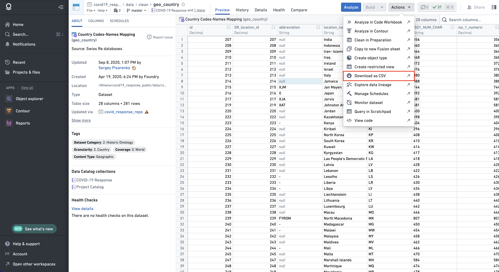

As for the vaccination data, you need to update `locations.csv` ([LINK](https://raw.githubusercontent.com/owid/covid-19-data/master/public/data/vaccinations/locations.csv)) and `vaccinations.csv` ([LINK](https://raw.githubusercontent.com/owid/covid-19-data/master/public/data/vaccinations/vaccinations.csv)) inside the `owid_downloaded` folder. Then you should run the `type_of_vax_country_generator.ipynb` notebook to generate the `type_of_vax.csv` file and the `vaccinations_generator.ipynb` notebook to generate the main `vaccinations.csv` file.

Weather data: you simply need to run the `get_weather_data.ipynb` notebook to generate the `weather_data.csv` file. However, please notice that you might have to update the API keys in the `weather_api_keys.txt` file. To do so, please generate new keys by signing up to [World Weather Online](https://www.worldweatheronline.com/developer/signup.aspx).

Finally, run the `final_data_generator.ipynb` notebook to generate the `final_data.csv` file and the `economic_df_builder.ipynb` notebook to generate the `economic_weighted.csv` file. 

## PLATFORM - BACKEND
---
The platform backend has been coded using Python's Flask framework. The entire code is available [here](https://github.com/epfl-iglobalhealth/what-if_platform_backend), and it is structured as follows:

```
.
├── APIs/
│   ├── __init__.py
│   └── endpoint.py
├── Dockerfile
├── application.py
├── environment.yml
├── model/
│   ├── __init__.py
│   ├── checkpoints/
│   │   ├── README.md
│   │   ├── reproduction_rate
│   │   └── unemp_rate
│   ├── config/
│   │   ├── economic_features.yaml
│   │   └── r_estim_features.yaml
│   ├── country_data.py
│   ├── data/
│   │   ├── README.md
│   │   ├── final_data.csv
│   │   ├── final_data_economic.csv
│   │   └── final_shap.csv
│   ├── hybrid.py
│   └── predict.py
└── requirements.yml
```
All the requirements and configurations are managed by Docker. To run the backend locally you can use the following command inside the main folder:
```
docker build -t whatif-backend .
```
```
docker run --name whatif-backend -p 7890:7890 whatif-backend
```
You can test that the backend is running on your local machine on port 7890 by using a tool like [Postman](https://www.postman.com/downloads/?utm_source=postman-home). An example of a request is shown below.

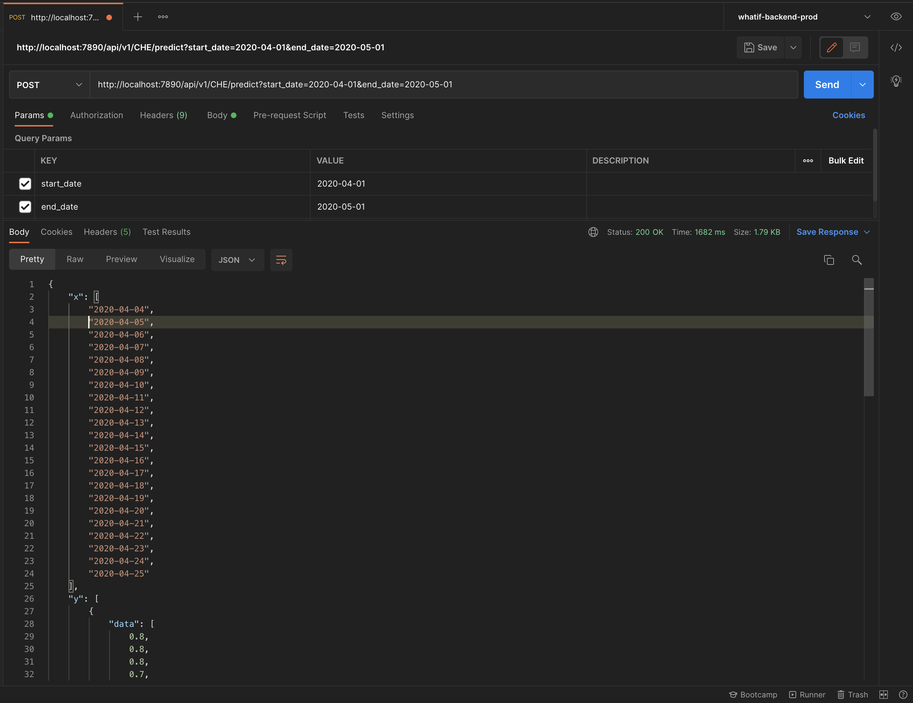

In the file `endpoint.py`, you can find the API endpoints. You can follow the same pattern to create new endpoints and add features to the platform. The file `predict.py` implements a lightweight version of the pipeline file presented in the [MODELS](#models) section. This is because it is expected that the models (one for each country) have already been trained before, and their checkpoints positioned in the `checkpoints` folder. The platform backend, indeed, is used only to make some inferences, and it is not expected that it will be used for training.
### ENDPOINTS

- POST `/api/v1/{iso_code}/predict`: returns the reproduction rate daily predictions for a given country and a given period. 
    _PARAMETERS_:
    - `start_date`: starting date of the period (format: YYYY-MM-DD)
    - `end_date`: ending date of the period (format: YYYY-MM-DD)
- GET `/api/v1/{iso_code}/get_constant_data`: returns the constant features for a given country (EG: population, GDP, etc.).
- GET `/api/v1/{iso_code}/get_variable_data/?start_date={start_date}&end_date={end_date}`: returns the variable features for a given country and a given period, on a weekly basis.
- POST `/api/v1/{iso_code}/predict_personalized`: returns the reproduction rate daily predictions for a given country and a given period, given the new set of policies and socio-economic characteristics decided by the user.
    _PARAMETERS_:
    - `start_date`: starting date of the period (format: YYYY-MM-DD)
    - `end_date`: ending date of the period (format: YYYY-MM-DD)
    - `features`: a list of new features (format: {'constant': {'feature_name1': value1, ...}, 'variable': {'dates': [date1, date2, ...], 'policies': [{'policy_name1': value1, ...}, ...]}})
- GET `/api/v1/{iso_code}/get_shap_values`: returns the global feature importance, for each policy, for the given country.
- GET `/api/v1/{type}/get_countries`: returns the list of countries for a given model (reproduction rate / unemployment rate). Type specifies the model and can be either `reproduction` or `economic`.
- GET `/api/v1/{iso_code}/predict_economic`: returns the unemployment rate predictions for a given country. The user can't specify the period for this model, given that there is only one economic prediction per month (versus a daily unemployment rate prediction).
- POST `/api/v1/{iso_code}/predict_economic_personalized`: returns the unemployment rate predictions for a given country, given the new set of policies and socio-economic characteristics decided by the user. The parameters start_date and end_date have been kept for backwards compatibility, but they should always be set to the first and last available date in the data.
 _PARAMETERS_:
    - start_date: starting date of the period (format: YYYY-MM-DD)
    - end_date: ending date of the period (format: YYYY-MM-DD)
    - features: a list of new features (format: {'constant': {'feature_name1': value1, ...}, 'variable': {'dates': [date1, date2, ...], 'policies': [{'policy_name1': value1, ...}, ...]}})

## PLATFORM - FRONTEND
---
The frontend has been coded using Angular. The code is available [here](https://github.com/epfl-iglobalhealth/what-if_platform_frontend).

### WORKFLOW
The user firstly visualizes a welcome page.
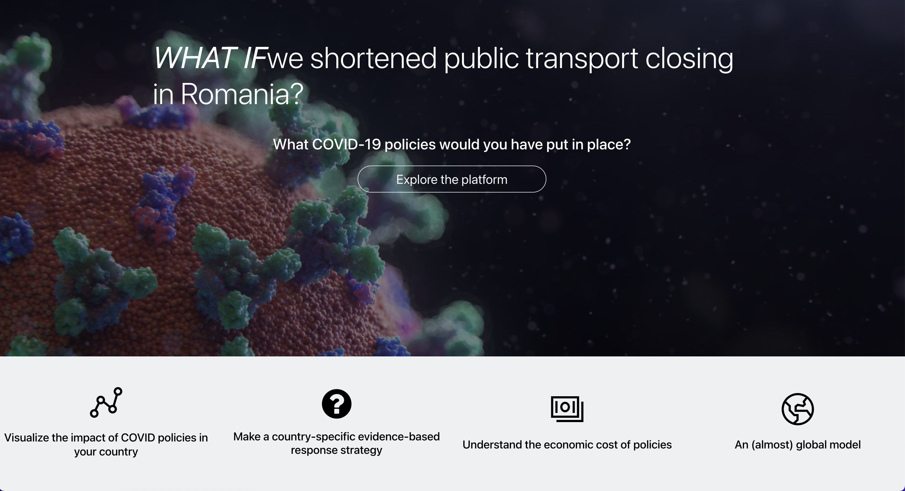

After clicking on `Explore the platform`, the user is redirected to the main page, where they can interact with the reproduction rate model. 

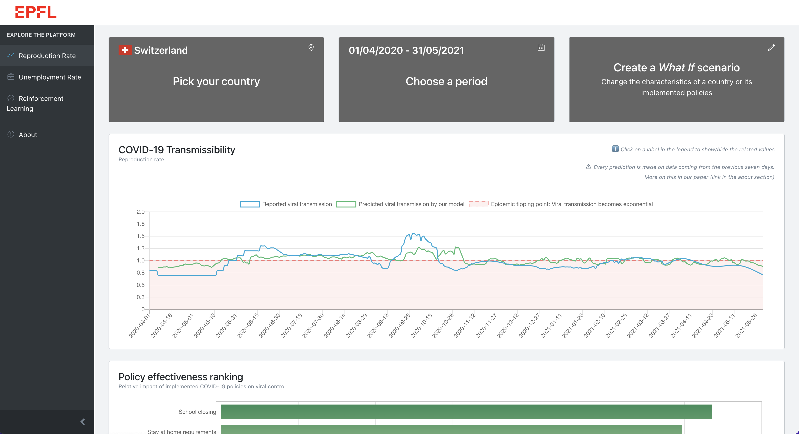


The main page is composed of a top bar with three buttons:
- **Pick your country**: used to select the country for which the user wants to make predictions.
- **Choose a period**: used to select the period for which the user wants to make predictions.
- **Create a _What If_ scenario**: used to change the characteristics of a country or its implemented policies for the selected period.

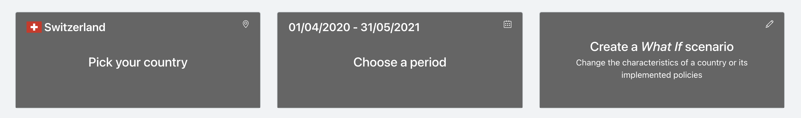

Right below the top bar, the user can interact with the COVID-19 transmissibility (reproduction rate) plot, which shows the reproduction rate predicted by our model vs. the reported one for the selected period. It is essential to notice that if the user changes the country's characteristics / adopted policies, we do not show the reported reproduction rate anymore, as it would not make sense since it was measured in different settings.

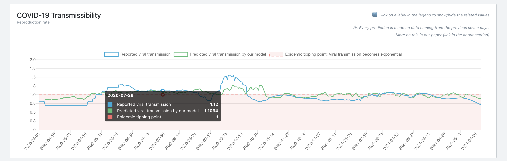

Below the reproduction rate plot, the user can visualize how, overall, each policy affected the reproduction rate for the selected country. In other words, we show the importance of each policy in fighting the virus spread.
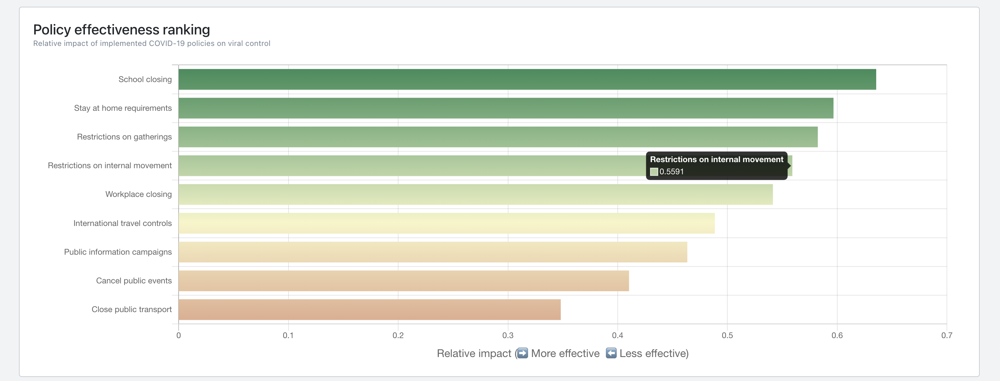

By clicking on `Create a What If scenario`, the user is redirected to a page where he/she can change the characteristics of a country or its implemented policies for the selected period. The page comprises two tabs, referring to the variable features (policies) and constant features (socio-economic characteristics). The user can change the stringency level of each policy on a weekly basis. 
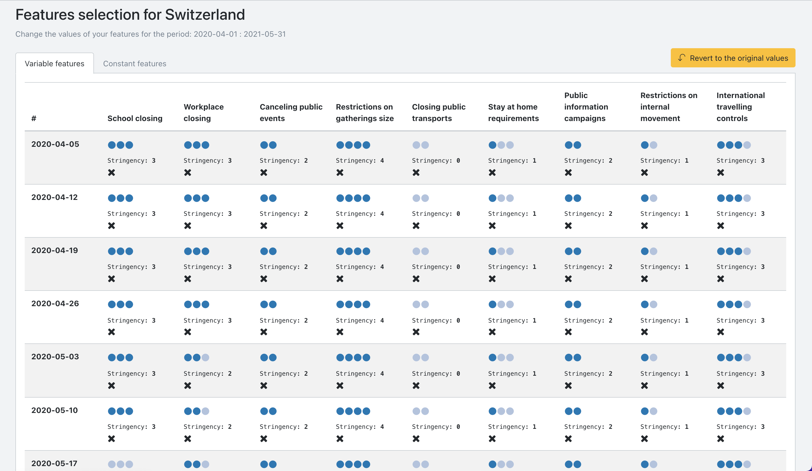
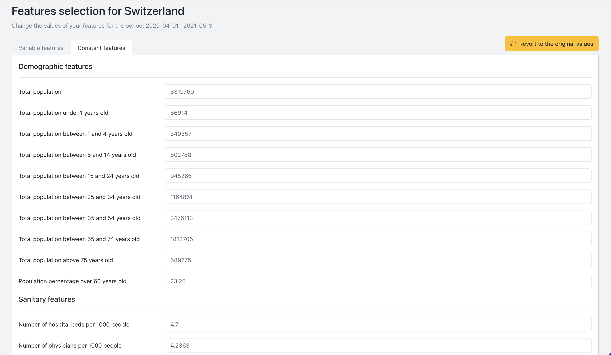

The user has then the option to ask the model to make a new prediction for the selected country and period, with the new feature set, or to go back to the previous page.

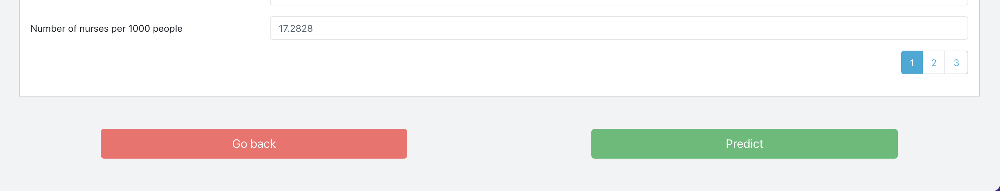

From the left navigation bar, in the main page, the user can then navigate to the unemployment rate section.

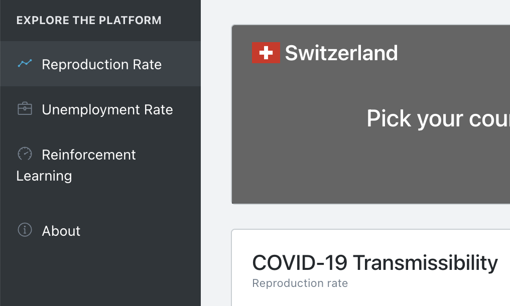

In the unemployment rate section, the top bar only consists of two buttons: 
- **Pick your country**
- **Create a _What If_ scenario**

This is because the granularity of the unemployment rate prediction is one month. Thus there is no need to select a specific period of time.
Right below the top bar, the user can interact with a bar-chart showing the predicted unemployment rate for the selected country vs. the measured one. However, again, if new features are selected to create a _What If_ scenario, the ground truth is hidden as it would be misleading, given that it was measured in different settings.

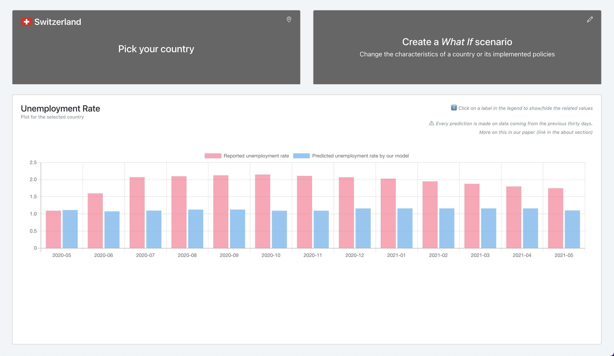

The Reinforcement Learning section is still under development.
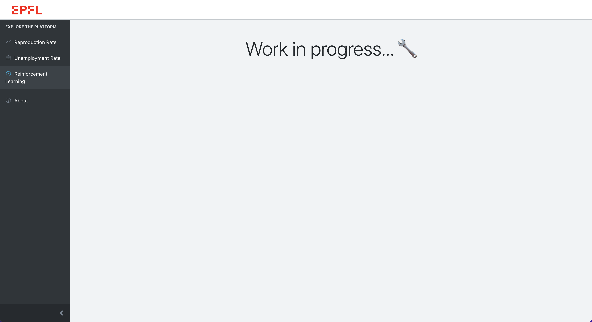

Finally, the About section contains some useful information about the project, like the link to our paper and to the iGH website.

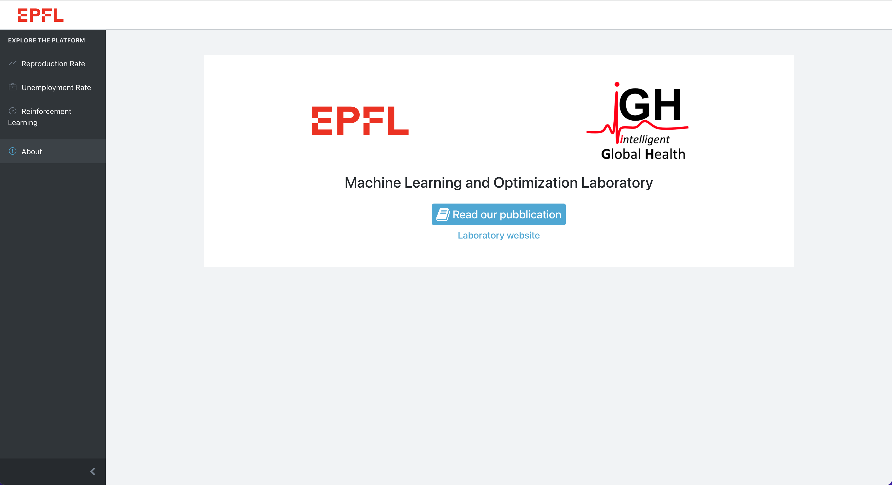

### FRONTEND CODE
To test the frontend and continue with its development, first of all run
```
npm install
```
to install all the dependencies.
Then run 
```
npm run start
```
to build and open the platform in your browser. Please, before doing so, run the backend with the commands in the [PLATFORM - BACKEND](#platform---backend). 

The code is structured as follows (we include only the main folders in the tree, removing the files for better readability):

```
.
├── Dockerfile
├── README.md
├── angular.json
├── nginx/
│   └── default.conf
├── package-lock.json
├── package.json
├── src/
│   ├── app/
│   ├── assets/
│   ├── environments/
│   │   ├── environment.prod.ts
│   │   └── environment.ts
│   ├── index.html
│   ├── main.ts
│   ├── scss/
```
Inside the `app` folder there are all the Angular's components and modules that have been used in the frontend. 

The `environments` folder is crucial. It contains two files, `environment.ts` and `environment.prod.ts`. The first one is used for development, while the second one is used for production. The `environment.ts` file contains the testing endpoints (localhost), while the `environment.prod.ts` file contains the production endpoints, to be used on a web server. Docker has been used for production deployment, and it uses the `environment.prod.ts` file.

To put the platform in production, change the paths in the `environment.prod.ts` according to where you host the backend, upload the code on a web server and then run the following commands. 

```
docker build -t whatif-frontend .
```
```
docker run --name whatif-frontend -p 80:80 whatif-frontend
```
Optionally, in the `nginx` folder, you can edit the `default.conf` file to change the configurations of the web-server.

## FUTURE WORK
---

### UPDATING
The data should be updated regularly. A pipeline to automate this would be valuable. Additionally the dates of the training data should be clearly stated on the main page in the form of "last model update:...".

### KEY EVENT
Some visualisations should be viewed in context. i.e. the emergence of various strains, vaccines etc.

### ADD DATA
We should source and add data on the % of strains in each country and the estimated seroprevalence of the population.
While it risks being uninformative, social media and news mentions of COVID, restictions and public sentiment (e.g. Twitter and news mentions) could also be added.

### MODELS
The unemployment rate is an economic indicator that is not measured daily. As explained in our paper, in order to try to relate the unemployment rate to the policies each country enforced, we used interpolation and many other tricks (see details in paper) to obtain a daily outcome. Still, this economic indicator is not available or poorly measured for many countries, and our model performances are not satisfactory.
As a future improvement, we would like to find a better macro- or micro-economic index, which is both more globally available and more reliable.

We identified [this research project](http://sustain.stanford.edu/predicting-poverty) from Stanford University, which might be a good start. They claim to be able to predict socioeconomic indicators of poverty and wealth through satellite images (specifically by nuancing night light maps with daytime map features). Given their work, the steps to follow would be:
- Try to reproduce their work to extract socioeconomic data from high-resolution daytime satellite imagery. 
- Once validated, one could use the predicted socioeconomic outcome as ground truth for the _What If...?_ economic model, including as many countries as possible. In particular, we would like to relate the newly estimated indicator to the restrictions each country implemented.

A good starting point to reproduce the paper mentioned above could be to use [this repository](https://worldbank.github.io/OpenNightLights/wb-light-every-night-readme.html).

### PLATFORM
As we showed, the Reinforcement Learning part of the project, despite having been validated, has not been implemented into the platform yet. Thus, you should implement new endpoints and expand the platform to include the RL models.

### SECONDARY ANALYSIS
The platform can be used to track the efficacy of policies over time for various countries which may be interesting in itself.
